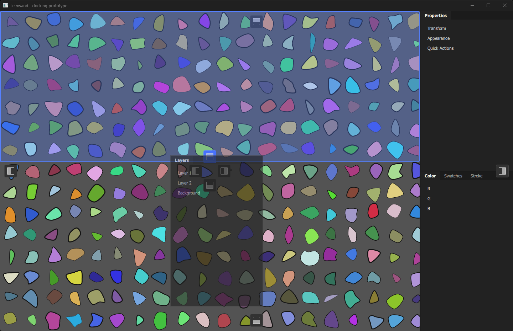
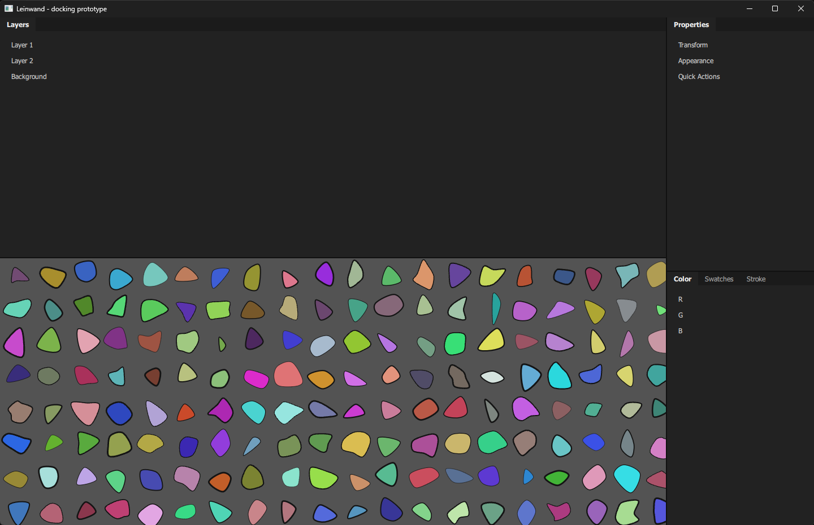

# M0 検証記録

フェーズ1計画(phase1-plan.md)の M0 で確かめる前提と、その結果を記録する。結果が出たら各節の「結果」を埋め、M1 へ進むか方針を見直すかを判断する。

| 検証 | 状態 |
| --- | --- |
| 1. Skia と Qt Quick が同じ Vulkan コンテキストで描画できるか | 成立(Windows、2026-10-02) |
| 2. 1万個のパスでズームとパンが滑らかか | 60Hz では成立。余裕は大きくない(下記) |
| 3. KDDockWidgets の見た目を Spectrum に合わせられるか | 条件付きで成立(KDDW へのパッチが必要、下記)。パッチを当てて採用と決定 |
| 付随: vcpkg の Skia で Vulkan・PDF・PathOps が有効にできるか | 成立(条件あり、下記) |

**計測環境**: Windows 11 Pro、AMD Ryzen 5 5600X、NVIDIA GeForce RTX 3060 Ti(ドライバー 591.34、Vulkan 1.4)、1920×1080 60Hz、Qt 6.8.3、Skia(vcpkg 2026.07.29 のポート)、Release ビルド。

## 付随: vcpkg の Skia

vcpkg のベースライン `9e593bb1`(タグ 2026.07.29)の `skia` ポートを調べた。

- `vulkan` と `pdf` はフィーチャーとして選べる。`vcpkg.json` では既定のフィーチャーを外し、`jpeg`、`pdf`、`png`、`vulkan` を指定した。
- PathOps はポートのパッチ(`010-always-build-pathops.patch`)で常にビルドされる。
- ヘッダーは `include/skia` の下に置かれ、`#include "include/core/SkCanvas.h"` の形で参照する。

確認方法: `tests/skia_features_test.cpp` が PathOps の和演算と PDF の書き出しを実行する。Vulkan は `render` が `GrDirectContexts::MakeVulkan` をリンクできることで確かめる。

**結果:** 成立。PathOps と PDF のテストが通り、Vulkan の描画も動いた。ただし次の2点が必要だった。

- **PDF には `jpeg` フィーチャーが要る。** 今の Skia は JPEG のエンコーダーとデコーダーを渡さないと PDF を作らない(`Must set both a jpegDecoder and jpegEncoder`)。`SkPDF::JPEG::MetadataWithCallbacks()`(`include/docs/SkPDFJpegHelpers.h`)を使う。
- **Vulkan のメモリアロケーターを自前で渡す必要がある。** vcpkg の Skia は内部の VMA アロケーターを組み込まずにビルドされており、`fMemoryAllocator` を渡さないと `GrDirectContexts::MakeVulkan` が null を返す。`src/render/vma_allocator.*` に、Skia の `VulkanAMDMemoryAllocator` と同じ規則の実装を置いた(VMA は vcpkg の `vulkan-memory-allocator`、MIT)。

Skia の再ビルド(フィーチャー変更時)はこの環境で約9分。

## 1. Skia と Qt Quick の統合

**方法**

- `QQuickWindow::setGraphicsApi(QSGRendererInterface::Vulkan)` で Qt Quick を Vulkan で動かす。
- キャンバスは `QQuickRhiItem`(Qt 6.7 以降)。`QRhi::nativeHandles()` から Qt が作った `VkInstance`、`VkPhysicalDevice`、`VkDevice`、`VkQueue` を取り出し、それで Skia の `GrDirectContext` を作る。VkDevice とキューは Qt と共有し、新しく作らない。
- 毎フレーム、アイテムの描画先テクスチャ(`VkImage`)を Skia の面としてラップして描き、Skia 側で `SHADER_READ_ONLY_OPTIMAL` へ遷移させて提出する。変えたレイアウトは `QRhiTexture::setNativeLayout` で QRhi に伝える。
- 実装: `src/render/vulkan_canvas.*`(Skia 側、Skia の型は外に出さない)、`src/app/canvas_item.*`(Qt 側)。

**懸念点(実機で確かめること)**

- Skia はキューへ独自に提出し、Qt のフレームのコマンドバッファはその後に提出される。提出順とレイアウト遷移のバリアで同期が足りるか。検証レイヤー(Vulkan SDK の `VK_LAYER_KHRONOS_validation`)を有効にして警告が出ないか確かめる。Qt 側は環境変数 `QSG_RHI_DEBUG_LAYER=1` で有効になる。
- Qt が有効にしたデバイス拡張を Skia には伝えていない。必要になったら `VulkanExtensions` に渡す。
- 描画先のフォーマットは `QQuickRhiItem` の既定(RGBA8)を前提にしている。

**成立しない場合**(計画どおり): テクスチャ経由の受け渡し、それも難しければ OpenGL。

**結果:** 成立。Qt Quick が作った VkDevice とキューをそのまま使って、Skia(Ganesh)がアイテムのテクスチャに描画できた。

- 検証レイヤーの警告は、Skia が描く前から Qt 自身が出しているもの(スワップチェーンのセマフォ再利用、`PREINITIALIZED` の画像作成、デバイスレイヤー指定)だけだった。Skia の提出に起因する警告は出ていない。ただし同期検証(synchronization validation)は有効にしていないので、提出順とバリアの正しさまでは確かめていない。
- QRhi のヘッダー(`rhi/qrhi.h`)は Qt 6.8 では `Qt6::GuiPrivate` 経由でしか使えない。Qt のバージョンを上げるときに API が変わる可能性がある。

## 2. 描画性能(1万パス)

**方法**

- `TestScene` が乱数で1万個の閉じた3次ベジェ(アンカー3〜7個)を格子状に並べる。各パスは塗りと線を持ち、アンチエイリアスあり。画面外の除外やキャッシュはわざと入れていない(素の性能を先に測る)。
- 手動: マウスホイールでズーム、ドラッグでパン。左上に fps と1フレームの描画時間(CPU 側で Skia の記録と提出にかかった時間)を表示する。
- 自動: `leinwand --bench` で10秒間ズームとパンを動かし、平均を標準出力に出して終了する。

**記録すること**: GPU とドライバー、解像度と拡大率、パス数(1万、必要なら5万)、fps、描画時間。fps はディスプレイのリフレッシュレートが上限になる。

**成立しない場合**(計画どおり): 描画結果のタイルキャッシュと画面外オブジェクトの除外を M1 より前に設計する。

**結果:** 1万パスは 60Hz で滑らか。ただし余裕は大きくない。

| パス数 | fps | 1フレームの CPU 時間 |
| --- | --- | --- |
| 10,000 | 60.8(リフレッシュレートが上限) | 7.2 ms |
| 50,000 | 41〜44 | 24〜25 ms |

- 1280×800 のウィンドウで、ズーム 0.15〜2.0 倍とパンを10秒間動かした平均。
- 1万パスでは 60Hz の1フレーム(16.7ms)の約43%を Skia の CPU 側の処理が使う。120Hz 以上のディスプレイ(1フレーム 8.3ms 以下)では足りない見込み。5万パスでは 60Hz も保てない。
- ボトルネックは CPU 側(Skia の記録と提出)。GPU 時間は測っていない。
- `--no-vsync` でスワップ間隔を0にしても約60fpsのままだった。Qt Quick のアニメーションの進み方が vsync の間隔(16.67ms)に固定されているため。上限なしの計測をするなら別の方法が要る。

**判断の材料:** 計画の基準(1万パスで滑らか)は満たした。ただ、パス数が増えると線形に遅くなるので、画面外オブジェクトの除外とタイルキャッシュは M1 の描画設計に最初から入れておくのがよい。

## 3. KDDockWidgets

**方法**

- 試作 `prototypes/dock`(実行ファイル `leinwand-dock-prototype`)。KDDockWidgets v2.4.1 の Qt Quick 版を使い、中央に検証2のキャンバス(1万パス)、右にパネル群(プロパティ、レイヤー、カラー、スウォッチ、線)を置いた。描画は本番と同じ Vulkan。
- KDDockWidgets は vcpkg ではなく CMake の FetchContent でソースから取り込む。vcpkg で入れると vcpkg が別の Qt をビルドしてしまうため。依存(KDBindings、nlohmann_json)は同梱されていて、追加は不要だった。
- 見た目は `ViewFactory` のサブクラスで差し替える。Spectrum 2 のトークン(`@adobe/spectrum-tokens` 15.5.0、ダーク、デスクトップ)の値は `qml/Spectrum.qml` に手で写した。本番ではビルド時に変換する(M5)。
- Illustrator に近づけるため、タブを常に表示し、タブがあるときはタイトルバーを隠す(`Flag_AlwaysShowTabs`、`Flag_HideTitleBarWhenTabsVisible`)。

**差し替えられたもの**

| 部品 | 方法 | 結果 |
| --- | --- | --- |
| タブ | `tabbarFilename()` | 可。Spectrum の色、24px(`component-height-75`)、12px の文字 |
| パネルの枠 | `groupFilename()` | 可。KDDW の Group.qml を簡略化 |
| タイトルバー | `titleBarFilename()` | 可。閉じるボタンにワークフローアイコンを使用 |
| 仕切り線 | `separatorFilename()` | 可。ホバーでアクセント色 |
| フローティングウィンドウの枠 | `floatingWindowFilename()` | 可 |
| ドロップ位置の表示(インジケーター) | **パッチが必要** | 下記 |
| ドロップ先の強調(ラバーバンド) | **パッチが必要** | 下記 |

**見つかった問題と対処**

1. **ドラッグ中に画面全体が黒くなる。** Qt Quick 版のドロップ表示は、半透明の最上位ウィンドウを画面に重ねて描く。Windows の Vulkan では半透明のウィンドウが合成されず、真っ黒になる。OpenGL と D3D11 では正しく透けることを確かめた(KDDW のサンプルが Windows で OpenGL ES を強制しているのも、おそらくこのため)。
   - KDDW には、ドロップ表示を別ウィンドウにせず、対象ウィンドウの中のアイテムとして描く経路がもともとある(Wayland 用)。パッチでこれを `InternalFlag_DisableTranslucency`(半透明ウィンドウが使えない環境向けの既存フラグ)でも使うようにした。これで黒くならない。
2. **ドロップ表示とラバーバンドの QML がライブラリ内に固定されている。** パッチで `ViewFactory` に `classicIndicatorsOverlayFilename()` と `rubberBandFilename()` を足し、差し替えられるようにした。
3. **ドロップ表示が、ドラッグ中のパネルに隠れる。** 1. の対処でドロップ表示が下のウィンドウの中に描かれるようになったため。ドラッグ中はフローティングウィンドウ全体の不透明度を 0.6 にして対処した。ウィンドウ単位の不透明度は OS が合成するので、Vulkan でも効く。ただし今はドラッグ中のものだけでなく、すべてのフローティングウィンドウが半透明になる。

パッチは `prototypes/dock/patches/kddw-indicators.patch`(4ファイル、39行。M5 で `cmake/patches/` へ移した)。FetchContent の取得時に当てる。KDDW 本体への提案(プルリクエスト)の候補。





**確かめたこと**: 初期配置、タブ切り替え、パネルのフローティング、ドラッグでのドッキング、ドッキング後のキャンバスの再描画。

**確かめていないこと**: タブへの合体(中央のインジケーター)、レイアウトの保存と復元(試作には Ctrl+Shift+S / Ctrl+Shift+R を用意した)、複数モニター、高 DPI、Linux での動作。Source Sans 3 はこの PC に入っていないので、フォントは Segoe UI で表示された。

**ライセンス上の注意**: KDDockWidgets は「GPL-2.0-only OR GPL-3.0-only」。Leinwand のソースは GPL-3.0-or-later のままでよいが、KDDW を組み込んだ配布物は全体として GPLv3 でしか配布できない(「or later」の選択肢が実質なくなる)。KDDW の QML から派生した試作のファイルには、KDDW のライセンス表記を付けた。

**結果:** 条件付きで成立。見た目は Spectrum に合わせられ、Vulkan のキャンバスとも同居できた。ただし Windows の Vulkan で使うには、上のパッチ(または同等の変更)を保守し続ける必要がある。判断の選択肢は次の3つ。

- パッチを当てて KDDW を使う(KDDW 本体に提案し、取り込まれればパッチは不要になる)。
- 計画どおりドッキングを自作する。
- Windows だけ Qt Quick の描画を D3D に替える(Skia も D3D 対応が必要になり、仕様 2章の「Vulkan が第一候補」と食い違う)。

**決定(2026-10-02):** パッチを当てて KDDockWidgets を使う。パッチは KDDW 本体への提案も検討する。

## ローカルでのビルド手順(Windows)

必要なもの: Visual Studio 2022 の「C++ によるデスクトップ開発」ワークロード(CMake と Ninja を含む)、Qt 6.8 以降(MSVC 2022 64-bit)、vcpkg、Vulkan SDK(検証レイヤー用。ビルド自体には不要)。

```
set VCPKG_ROOT=C:\path\to\vcpkg
set QT_ROOT_DIR=C:\Qt\6.8.x\msvc2022_64
cmake --preset windows-release
cmake --build --preset windows-release
ctest --preset windows-release
```

コマンドは「x64 Native Tools Command Prompt for VS 2022」から実行する。

- このプロンプトでは VS 同梱の CMake(3.31)が先に見つかる。これは vcpkg が取得する一部のソースアーカイブ(pkgconf 3.0.3 など)を展開できず、`Invalid empty pathname` で失敗する。単体で入れた CMake(4.x)を先に使うため、最初に `set "PATH=C:\Program Files\CMake\bin;%PATH%"` を実行する。
- 実行時は `%QT_ROOT_DIR%\bin` を PATH に入れるか、`windeployqt` で DLL を集める。
- ドッキングの試作: `build\windows-release\prototypes\dock\leinwand-dock-prototype.exe`。`--backend=opengl|d3d11` で描画を切り替えられる(キャンバスは Vulkan のときだけ描かれる)。`--translucent-indicators` でパッチ前のドロップ表示(半透明ウィンドウ)に戻せる。
- ベンチマーク: `leinwand --bench --paths=10000`(結果は標準エラーに出る。`QT_FORCE_STDERR_LOGGING=1` を設定する)。
